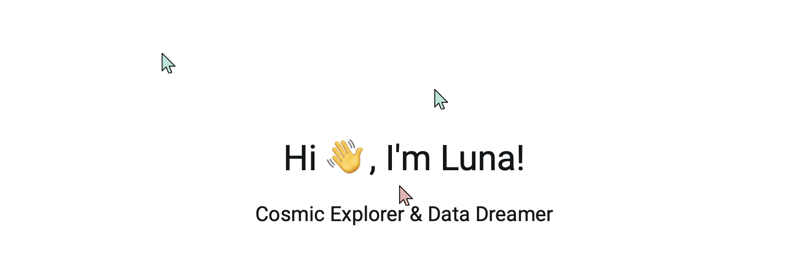

# Guest Cursor Server

A websockets server running the backend for seeing other visitors' cursors at [lunalux.io](https://lunalux.io/building-a-home-lab/guest-cursors-an-occasional-shadow-of-a-stranger/). Based on [Robert's demo](https://github.com/Robert-96/websockets-cursor-sharing), I have added a few features such as multi-page support, so it doesn't show cursors from other pages, and the ability to handle scroll events as well as nicely handling touch devices.

This is just the server part of the project. You can see how it's implemented client-side in the [lunalux.io repository](https://github.com/lunaluxie/lunalux.io/blob/main/home/templates/components/cursor.html).
